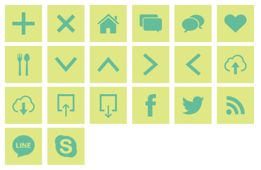

# (Swift2.0) KRIcon v1.0
KRIconは，UIBezierPathによって描かれたアイコンセットになっています．

## 特徴
### UIBezierPath
画像ではなく，UIBezierPathによる描画のため，軽量化を実現しています．
また，拡大縮小，塗り色，線色の変更が容易になりました．

### StoryBoardでの設定
KRIconViewは，StoryBoard上でも設定が可能です．
Classを`KRIconView`に変更し，属性インスペクターにて，アイコンの種類，色を変更できます．

## 使い方
` KRIcon.swift ` ，`KRIconVIew.swift`をプロジェクトに追加して使用してください．

### アイコンタイプの変更
```
iconView.iconType = .TYPE_Home
```

## 種類
- TYPE_Add
- TYPE_Close
- TYPE_Home
- TYPE_Balloon1
- TYPE_Balloon2
- TYPE_Heart
- TYPE_Food
- TYPE_ArrowB
- TYPE_ArrowT
- TYPE_ArrowR
- TYPE_ArrowL
- TYPE_CloudUp
- TYPE_CloudDown
- TYPE_Share
- TYPE_Download
- TYPE_Facebook
- TYPE_Twitter
- TYPE_Rss
- TYPE_Line
- TPEY_Skype



## 拡張
個人でアイコンを作成したものを追加したい場合は，以下のようにします．
```
extension IconType {
    var myPath :UIBezierPath {
        let path = UIBezierPath()

        // your path

        return path
    }
}
```
使用時
```
override func drawRect(rect: CGRect) {
  let path :UIBezierPath = IconType.TYPE.myPath
  path.stroke()
}
```

## 今後の拡張予定
順次需要のありそうなものを追加していくつもりです．
